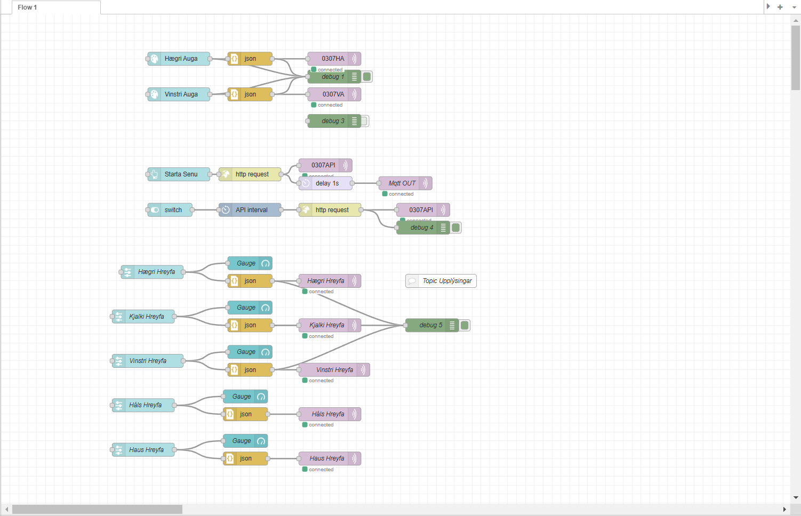
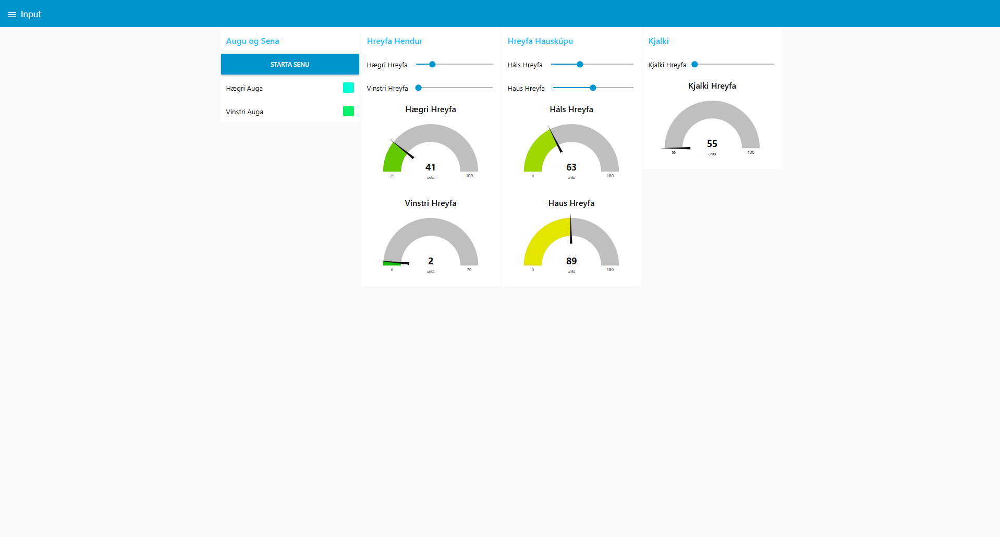

# VESM3_Loka_verkefni

### Nemendur:
* Daníel Snær Rodriguez
* Erpur Þórhallsson
* Pétur Jónsson
  

### Kennari:
* Gunnar Þórunnarson


### Lýsing
þetta er IOT Verkefni þar sem við erum með hauskúpu og skjá sem senda á milli gögn yfir netið gegnum MQTT.
Við bjuggum til Sena af veður kona að spá veðrinu. Hauskúpan tekur inn hitastig og humidity frá Openweather API og frá hitaskynjara tengt við hauskúpunna.
Svo er skjár sem tekur á móti upplýsingum frá Hauskúpunni og birtir myndir eftir veðrinu. svo höfum við Node Red GUI sem byrjar senu og getur fært mótorana og breytt augnalit hauskúpunnar.

### Íhlutir

* ESP32
* 2 Rasperry Pi
* 64x64 LED skjár
* Hátalari
* DF Player
* 4 Servo mótor
* 2 RGB LED
* DH22 Hita og raka skynjari


### Sena


### Tenginar


## Kóði

### Hauskúpa
```python
from binascii import hexlify
from umqtt.simple import MQTTClient
from machine import Pin, unique_id, ADC, PWM
from time import sleep_ms
from servo import Servo
import asyncio, json
import ujson
import time
import machine
import dht

MQTT_BROKER = "10.201.48.103" 
CLIENT_ID = hexlify(unique_id())

WIFI_SSID = "TskoliVESM"
WIFI_LYKILORD = "Fallegurhestur"

# Main topic eru augu og Senu switch
# Fyrsti stafur er annað hvort H = Hægri eða V = Vinstri EÐA K = Kjalki EÐA U = Haus EÐA S = Háls
# Annar stafur er annað hvort
# M = Hreyfa (Move) eða S = Hraði (Speed) eða A = Auga
MAIN_TOPIC = b"0307LOKA"
HM_TOPIC = b"0307HM"
VM_TOPIC = b"0307VM"
KM_TOPIC = b"0307KM"
UM_TOPIC = b"0307UM"
SM_TOPIC = b"0307SM"
HA_TOPIC = b"0307HA"
VA_TOPIC = b"0307VA"

#Allt sem byrjar á 0307 eru skilaboð frá Node-RED, 2703 eru skilaboð frá hauskúpunni, 2709 eru skilaboð frá PI-2 skjánum
API = b"0307API"
start_sena = b"0307StartSena"
senda_API = b"2703sendaAPI"
skjar_buinn_humidity = b"2709buinn_humidity"
senda_humidity = b"2703Buinn"
skjar_buinn_vedur = b"2709buinn_vedur"

def do_connect():
    import network
    wlan = network.WLAN(network.STA_IF)
    wlan.active(True)
    if not wlan.isconnected():
        print('connecting to network...')
        wlan.connect(WIFI_SSID, WIFI_LYKILORD)
        while not wlan.isconnected():
            pass
    print('network config:', wlan.ifconfig())
    
do_connect()
#stilli i_gangi breytuna
global i_gangi
i_gangi = False

dht22 = dht.DHT22(machine.Pin(2))

# Klasi fyrir mótorana
# Heldur utan um minnst og mest sem mótor getur hreyft
# normal er þegar mótorinn er "venjulegur" / upprétt
# Tekur inn (mótorinn sjálfan, minnst, mest, upprétt)
class Motor:
    def __init__(self, motor, minnst, mest, normal):
        self.motor = motor
        self.min = minnst
        self.max = mest
        self.normal = normal
    
    def hreyfa_motor(self, i):
        self.motor.write_angle(i)

# Klasi fyrir augun sem tekur inn peruna hjá auganu
class Auga:
    def __init__(self, raudur, graenn, blar):
        self._raudur = raudur
        self._graenn = graenn
        self._blar = blar
    
    
    # Fall til að breyta um lit á perunni
    def breyta_lit(self, rgb):
        
        #rgb = [litur for litur in json.loads(rgb).values()]
        rgb = json.loads(rgb)
        
        self._raudur.value(0)
        self._graenn.value(0)
        self._blar.value(255)
        

# Mótorarnir sjálfir
vinstri_motor = Servo(Pin(5))
haegri_motor = Servo(Pin(4))
haus_motor = Servo(Pin(6))
hals_motor = Servo(Pin(7))
kjalki_motor = Servo(Pin(15))

# Mótorarnir í Motor klasanum
# Nota þessa
HondLeft = Motor(vinstri_motor, 0, 70, 70)
HondRight = Motor(haegri_motor, 25, 100, 0)
Haus = Motor(haus_motor, 0, 180, 90)
Hals = Motor(hals_motor, 0, 180, 67)
Kjalki = Motor(kjalki_motor, 55, 100, 65)

# Auga Litir
Lblar = Pin(35, Pin.OUT)
Lraudur = Pin(36, Pin.OUT)
Lgraenn = Pin(37, Pin.OUT)
Rraudur = Pin(41, Pin.OUT)
Rblar = Pin(39, Pin.OUT)
Rgraenn = Pin(40, Pin.OUT)

# Augna litir í lista í RGB format
AugaH = Auga(Rraudur, Rgraenn, Rblar)
AugaV= Auga(Lraudur, Lgraenn, Lblar)


# Hátalari uppsetning
from lib.dfplayer import DFPlayer
df = DFPlayer(2)
df.init(tx=16, rx=17)

# Tekur inn file og spilar það
# Verður að vera async
async def spila_hljod(file1, file2):
    await df.volume(30)
    await df.play(file1, file2)
    await asyncio.sleep_ms(0)
    
async def sena1(location, humidity_skynjari):
    global hitastig, humidity, vedur, i_gangi
    #ef að senan var keyrð frá skynjaranum, þá sendir það upplýsingar úr skynjaranum, ef ekki úr global variable
    if location == "skynjari": 
        mqtt_client.publish(senda_API, ujson.dumps({"hitastig": hitastig, "humidity": humidity_skynjari, "vedur": vedur}))
    else:
        mqtt_client.publish(senda_API, ujson.dumps({"hitastig": hitastig, "humidity": humidity, "vedur": vedur}))
    
    asyncio.create_task(spila_hljod(1,2))
    print("ding")
    i_gangi = True

async def skynjari():
    global humidity, i_gangi
    while True:
        try:
            # Trigger measurement
            dht22.measure()
            #temperature = dht22.temperature()  # In Celsius
            raki = dht22.humidity()       # Relative humidity

            # Print the values
            #print("Temperature: {:.1f}°C".format(temperature))
            print("Humidity: {:.1f}%".format(raki))

            #Ef að rakinn er hár og senan er ekki í gangi þá keyrir hann senuna
            if raki > 70 and i_gangi == False:
                #runna start dæminu
                asyncio.create_task(sena1("skynjari", raki))
                humidity = raki

        except OSError as e:
            print("Failed to read sensor data:", e)
        await asyncio.sleep(2)  # You need a little wait for stable readings

async def sena_humidity(humidity):
    await asyncio.sleep(2) 
    await spila_hljod(1, 3)
    await asyncio.sleep(0.5) 
    #hreyfir hendur einu sinni fyrir hverja 10% af raka
    for i in range(int(humidity // 10)):
        HondLeft.hreyfa_motor(70) 
        await asyncio.sleep(0.2)
        HondLeft.hreyfa_motor(0) 
        await asyncio.sleep(0.2) 
    

    #sendir skilaboð í skjáinn að það sé búið að hreyfa eftir raka 
    mqtt_client.publish(senda_humidity, ujson.dumps({"hitastig": True}))
    print("Búinn að hreyfa eftir humidity")
  
async def sena_vedur(vedur, hitastig):
    global i_gangi
    await asyncio.sleep(2) 
    #Eftir því hvaða veður það er þá spilar það áhveðin hljóð
    if vedur == "Rain":
        asyncio.create_task(spila_hljod(3, 4))
        await asyncio.sleep(0.5) 
        asyncio.create_task(spila_hljod(2, 4))
        pass
    elif vedur == "Clouds":
        asyncio.create_task(spila_hljod(3,1))
        await asyncio.sleep(0.5) 
        asyncio.create_task(spila_hljod(2,1))
        pass
    elif vedur == "Clear":
        asyncio.create_task(spila_hljod(3,2))
        await asyncio.sleep(0.5)
        asyncio.create_task(spila_hljod(2,2))
        pass
    elif vedur == "Snow":
        asyncio.create_task(spila_hljod(3,3))
        await asyncio.sleep(0.5)
        asyncio.create_task(spila_hljod(2,3))
        pass
    
    for i in range(abs(int(hitastig))):
        HondRight.hreyfa_motor(70)
        await asyncio.sleep(0.2)
        HondRight.hreyfa_motor(25) 
        await asyncio.sleep(0.2)
    print("Búinn að hreyfa eftir veðri")
    i_gangi = False
    
def fekk_skilabod(topic, skilabod):
    # Stilli global variables fyrir veður gögnin, léttara þannig
    
    global API_Data, hitastig, humidity, vedur, i_gangi
    # Breyta skilaboði og topic úr bytes í eitthvað lesanlegt t.d. int, str
    
    
    # Ef að senan er ekki í gangi þá kíkir það hvort að skilaboðin séu tengd því
    
    #Þegar skjárinn er búinn að birta raka þá keyrir þetta
    if topic == skjar_buinn_humidity:
        asyncio.create_task(sena_humidity(humidity))

    #Þegar skjárinn er búinn að birta hitastig þá keyrir þetta
    elif topic == skjar_buinn_vedur:
        asyncio.create_task(sena_vedur(vedur, hitastig))
        
    # Topic til að hreyfa hægri hendi
    elif topic == HM_TOPIC:
        print("hægri", skilabod)
        HondRight.hreyfa_motor(int(skilabod))
    
    # Topic til að hreyfa vinstri hendi
    elif topic == VM_TOPIC:
        print("vinstri", skilabod)
        HondLeft.hreyfa_motor(int(skilabod))
        
    # Topic til að hreyfa kjálkann
    elif topic == KM_TOPIC:
        print("kjalki", skilabod)
        Kjalki.hreyfa_motor(int(skilabod))

    # Topic til að hreyfa Hausinn
    elif topic == UM_TOPIC:
        print("haus", skilabod)
        Haus.hreyfa_motor(int(skilabod))
        
    # Topic til að hreyfa hálsinn
    elif topic == SM_TOPIC:
        print("háls", skilabod)
        Hals.hreyfa_motor(int(skilabod))

    # Breyta lit á hægri auga
    elif topic == HA_TOPIC:
        AugaH.breyta_lit(skilabod)
        
    # Breyta lit á hægri auga
    elif topic == VA_TOPIC:
        augaV.breyta_lit(skilabod)
        
    elif i_gangi == False:
        # Fær API gögn og geymir, keyrir ef X
        if topic == API:
            message = ujson.loads(skilabod)
            print("Fékk API")
            #Vinnur úr API'inu
            hitastig = message["main"]["temp"]
            humidity = message["main"]["humidity"]
            vedur = message["weather"][0]["main"]
            #Ef að það er X mikið hitastig þá keyrir hann senuna
            if hitastig > 15 or hitastig < 1:
                asyncio.create_task(sena1("api", 1))
                print(f"Ég er að runna vegna þess að það er: {hitastig}°C")
            # Ef að það er X veður þá keyrir hann senuna
            elif vedur in ("Rain", "Snow"):
                asyncio.create_task(sena1("api", 1))
                print(f"Ég er að runna vegna þess að það er: {vedur}")

        # Keyrir senuna
        elif topic == start_sena:
            asyncio.create_task(sena1("start", 1))
            

#fleiri MQTT stillingar
mqtt_client = MQTTClient(CLIENT_ID, MQTT_BROKER, keepalive=60)
mqtt_client.set_callback(fekk_skilabod)
mqtt_client.connect()

# Tengja við öll Topic
mqtt_client.subscribe(MAIN_TOPIC)
mqtt_client.subscribe(HM_TOPIC)
mqtt_client.subscribe(VM_TOPIC)
mqtt_client.subscribe(KM_TOPIC)
mqtt_client.subscribe(UM_TOPIC)
mqtt_client.subscribe(SM_TOPIC)
mqtt_client.subscribe(KM_TOPIC)
mqtt_client.subscribe(HA_TOPIC)
mqtt_client.subscribe(VA_TOPIC)
mqtt_client.subscribe(API)
mqtt_client.subscribe(start_sena)
mqtt_client.subscribe(skjar_buinn_humidity)
mqtt_client.subscribe(skjar_buinn_vedur)

# Aðalkóði
# Les og sendir skilaboð
# Beinagrind er keyrð hér
async def main():
    asyncio.create_task(skynjari())
    # Hvar allt gerist
    while True:    
        # Leita af skilaboði
        mqtt_client.check_msg()
        #kveiki á skynjaranum, látum hann runna á 2 sekúnda fresti
        
        # Bíða í 0.01 sec
        await asyncio.sleep(0.01)            
# Starta program

asyncio.run(main())
```


### Skjár
```python
import paho.mqtt.client as mqtt
import json
import asyncio
import RPi.GPIO as GPIO
from time import sleep
import os
from rgbmatrix import RGBMatrix, RGBMatrixOptions
from PIL import Image


# Tenging fyrir WIFI

# Allt tengt MQTT
# Broker er Rasperry pi
# Allar mqtt tengingar eru á milli beinagrinds og Skjássins
WIFI_SSID = "TskoliVESM"
WIFI_LYKILORD = "Fallegurhestur"
MQTT_BROKER = "10.201.48.103"
CLIENT_ID = os.urandom(8).hex()
senda_API = "2703sendaAPI"
skjar_buinn_humidity = "2709buinn_humidity"
sena_humidity = "2703Buinn"
skjar_buinn_vedur = "2709buinn_vedur"

# Connect to Wi-Fi (handled automatically by Raspberry Pi OS)
print("Make sure your Raspberry Pi is connected to Wi-Fi.")

# GPIO Setup
GPIO.setmode(GPIO.BCM)

# MQTT Setup
mqtt_client = mqtt.Client(CLIENT_ID)
# Image configuration for weather display


# File path fyrir myndirnar
# 64x64 format
image_files = {
    "Rain": "/home/pi/Desktop/rain.jpeg",
    "Clouds": "/home/pi/Desktop/123.png",
    "Clear": "/home/pi/Desktop/sun.jpeg",
    "Snow": "/home/pi/Desktop/snow.jpeg"
}

# Configuration for the matrix
options = RGBMatrixOptions()
options.rows = 64
options.cols = 64
options.chain_length = 1
options.parallel = 1
options.hardware_mapping = 'adafruit-hat'

matrix = RGBMatrix(options=options)


# Breytur sem geyma hitastig, humidity og veður
# Kemur allt frá Veður API
# Humidity kemur frá Hita skynjara ef humidity er >70%
hitastig = None
humidity = None
vedur = None


# Async fall sem birtir humidity á skjáin
# Publish'ar á MQTT að skjárinn hefur birt mynd á skjáinn
async def publish_humidity():
    image = Image.open["/home/pi/Desktop/123456.jpg"]
    matrix.SetImage(image.convert('RGB'))
    mqtt_client.publish(skjar_buinn_humidity, json.dumps({"buinn": True}))
    print("Buinn ad birta humidity")


# Async fall sem birtir Mynd af veðri
# Notar vedur breytuna til að finna veðrið
async def publish_weather(vedur, hitastig):

    # Ef það er rigning
    # Prentar hitastig með upplýsingum
    if vedur == "Rain":
        image = Image.open("/home/pi/Desktop/sun.jpeg")
        matrix.SetImage(image.convert('RGB'))
        print(f"Displaying Rain icon with temperature {hitastig}")

    # Ef það er Skýjað
    elif vedur == "Clouds":
        image = Image.open("/home/pi/Desktop/123.png")
        matrix.SetImage(image.convert('RGB'))

    # Ef það er Heiðskýrt
    elif vedur == "Clear":
        image = Image.open("/home/pi/Desktop/sun.jpeg")
        matrix.SetImage(image.convert('RGB'))

    # Ef það er að snjóa
    elif vedur == "Snow":
        image = Image.open("/home/pi/Desktop/snow.jpeg")
        matrix.SetImage(image.convert('RGB'))

    # Publish'ar til MQTT að skjárinn hefur birt myndina
    mqtt_client.publish(skjar_buinn_vedur, json.dumps({"buinn": True}))


# Tekur á móti MQTT skilaboðum
# Decode'ar skilaboðið með .decode()
# Gefur breytunum hitastig, humidity, vedur upplýsingar
async def received(topic, msg):

    # Global breytur til að nota í publish_weather() og publish_humidity()
    global hitastig, humidity, vedur

    # Decode'ar skilaboðið
    # Breytir úr JSON -> Dict
    message = json.loads(msg.decode())

    # Ef skilaboðið kemur frá Veður API
    if topic == senda_API:
        hitastig = message['hitastig']
        humidity = message['humidity']
        vedur = message['vedur']
        await publish_humidity()

    # Ef skilaboðið Beinagrindinni
    elif topic == sena_humidity:
        print("sena")
        await publish_weather(vedur, hitastig)


def on_message(client, userdata, msg):
    asyncio.run(received(msg.topic, msg.payload))


# Tengjast við MQTT
mqtt_client.on_message = on_message
mqtt_client.connect(MQTT_BROKER)
mqtt_client.subscribe(senda_API)
mqtt_client.subscribe(sena_humidity)


# Main
# Async
# Leita á 2s fresti
async def main_loop():
    mqtt_client.loop_start()
    while True:
        # Replace `skynjari()` with your sensor reading logic if needed
        await asyncio.sleep(2)


# Bryja forrit
try:
    asyncio.run(main_loop())

# Ef ctrl+c er farið úr loop og hætt
except KeyboardInterrupt:
    print("Exiting program.")
    mqtt_client.loop_stop()
    GPIO.cleanup()
```

### Skjár upplýsingar 

64x64 screan 

ip 10.201.48.114

script to download libarary for the screan 
curl https://raw.githubusercontent.com/adafruit/Raspberry-Pi-Installer-Scripts/master/rgb-matrix.sh > rgb-matrix.sh

comand to set up library 
sudo ./rgb-matrix.sh


#### Connect to Raspberry Pi with GUI
* Download [RealVNC Viewer](https://www.realvnc.com/en/connect/download/viewer/)
* Log-in unnecessary
* File > New Connection
  * VNC Server: `10.201.48.144`
  * OK
* Password: `Verksm1dja`

#### Connect to Raspberry Pi with ssh
* sudo pi@10.201.48.114
* password 'Verksm1dja'

#### most comon comands 
pi@h24vesm8:~ $ sudo python3 /home/pi/Desktop/test.py


### Node Red

#### Dashboard



#### GUI



#### flows.json


